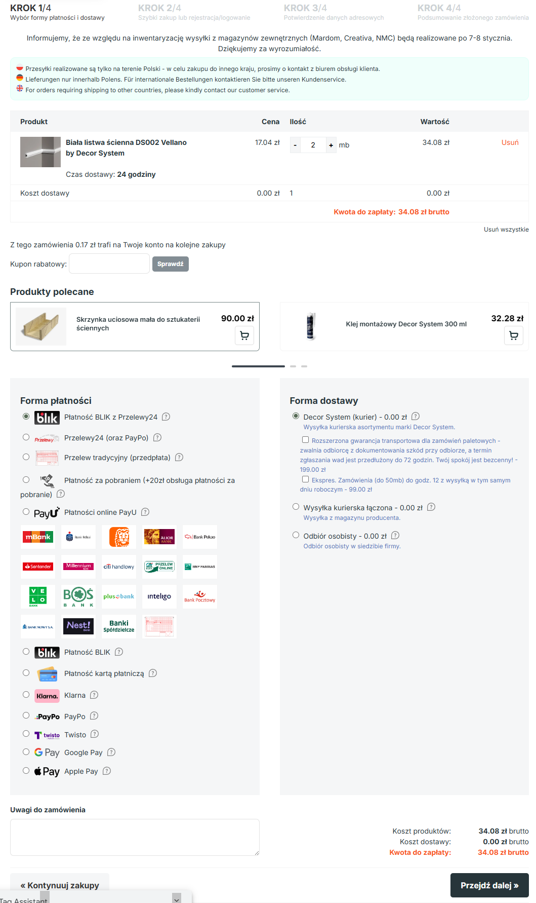

# Zmiany w kodzie domeny decormarket.pl

# Specyfikacja Wdrożeniowa Analityki E-commerce (GA4)

Wersja dokumentu: 1.3

Autor: Patryk Skibiński

Status: Do wdrożenia

Odbiorca: Dział IT / Programiści

🔗 [Zobacz wersję dokumentacji w Notion](https://hill-wrist-ec0.notion.site/Zmiany-w-kodzie-domeny-decormarket-pl-2e1e9eafec2c80c98fb9ef784bf4e684?source=copy_link)

---

# 1. Wstęp i Kontekst Biznesowy

Celem niniejszego dokumentu jest ustandaryzowanie zbierania danych analitycznych na domenie decormarket.pl. Obecna konfiguracja rejestrowanych eventów posiada luki w ścieżce zakupowej (Checkout Funnel) oraz w monitorowaniu interakcji użytkownika z produktami na listach (listingi, bestsellery). Szablony danych wysyłanych do dataLayer przy obecnie rejestrowanych zdarzeniach nie wykorzystują w pełni potencjału GA4, ze względu na ograniczoną ilość wysyłanych parametrów.

29.12.25r. na koncie Google Tag Manager powiązanym z domeną decormarket.pl, wraz z konsultantką Google dodano nowy Tag o nazwie “Ecommerce”, mający za zadanie odbierać dane ze strony internetowej do konta Google Analytics 4. Szczegóły jego konfiguracji (nazwy eventów i ich parametrów) znajdują się w **trzecim rozdziale** dokumentu. Zachowanie **tych samych nazw** eventów oraz ich parametrów w skryptach kodu źródłowego strony jest kluczowe do poprawnego działania GA4. Nazwy eventów oraz parametrów w tym dokumencie zostały zdefiniowane zgodnie z dokumentacją techniczną Google - to warunek konieczny do generowania automatycznych raportów w aplikacji GA4.

Wdrożenie poniższych wytycznych pozwoli na:

1. **Pełne wykorzystanie potencjału narzędzi analitycznych:** Wzbogacenie dataLayer o nowe parametry pozwoli budować bardziej szczegółowe raporty i eksploracje w GA4 oraz umożliwi stworzenie profesjonalnej bazy danych w BigQuery (analityka i automatyzacje).
2. **Precyzyjne określenie miejsc utraty klienta:** Dzięki pełnemu lejkowi (od koszyka, przez wybór dostawy i płatności, po zakup) dowiemy się, dlaczego użytkownicy rezygnują z zakupów.
3. **Optymalizację oferty produktowej:** Zdarzenia listowe (`view_item_list`, `select_item`) pozwolą ocenić, które pozycjonowanie produktów (Bestsellery vs Nowości) generuje wyższy CTR i konwersję.

### 1.1. Standardy Techniczne (Globalne)

Wszystkie zdarzenia muszą spełniać poniższe wymogi techniczne:

- **Pełny zasięg kontenera GTM:** Kod kontenera Google Tag Manager musi zostać zaimplementowany na **każdej** podstronie serwisu (w sekcjach `<head>` oraz `<body>`). Obecna diagnostyka wykazuje, że na części podstron kod GTM nie jest ładowany, co skutkuje dziurami w danych. Prosimy o zaimplementowanie tagów na każdej stronie domeny decormarket.pl. Tabela z listą znajduje się w pliku [Lista nieotagowanych stron](Lista_nieotagowanych_stron.xlsx).
- **Higiena kodu (Usunięcie reliktów):** Należy usunąć z kodu źródłowego wszelkie nieużywane skrypty analityczne, w szczególności stare tagi **Universal Analytics (UA)**. Pozostawienie ich może powodować konflikty danych i niepotrzebnie obciąża stronę.
- **Struktura danych:** Utrzymujemy obecnie stosowany obiekt `eventModel` jako kontener na dane e-commerce.
- **Typy danych:** Wartości finansowe (`price`, `value`, `shipping`, `tax`, `discount`) muszą być przesyłane jako **Liczby (Number)** z kropką jako separatorem dziesiętnym (np. `145.50`), a nie jako tekst.
- **Waluta:** Kod `PLN` musi być obecny w każdym zdarzeniu transakcyjnym.
- **Struktura Produktu:** Obiekt produktu w tablicy `items` musi być spójny w całym serwisie (te same ID i nazwy w koszyku, co w zamówieniu).

---

# 2. Lista eventów priorytetowych

Poniżej wylistowano zdarzenia do zaktualizowania lub wdrożenia, które są wymagane do poprawnego działania analityki. Szczegółowa dokumentacja dla każdego z nich znajduje się w **rozdziale czwartym** dokumentu.

### Grupa 1: Core E-commerce (Checkout Funnel)

W tabeli poniżej wymieniono zdarzenia, które należy zaktualizować lub wdrożyć, w celu poprawnego działania raportów w GA4 związanych zachowaniem klienta w koszyku.

| **Nazwa Zdarzenia (Event)** | **Miejsce wywołania (Trigger)**                                            | **Status**                     |
| --------------------------- | -------------------------------------------------------------------------- | ------------------------------ |
| add_to_cart                 | Kliknięcie "Dodaj do koszyka" (karta produktu/lista)                       | 🟡 DataLayer do zaktualizowania |
| view_cart                   | Wejście na stronę `/koszyk`                                                | 🟡 DataLayer do zaktualizowania |
| remove_from_cart            | Kliknięcie "Usuń" (X) w koszyku **lub zmniejszenie ilości produktu do 0.** | 🟡 DataLayer do zaktualizowania |
| begin_checkout              | Kliknięcie "Przejdź dalej" w 1. kroku koszyka                              | 🔴 **Do wdrożenia**             |
| add_shipping_info           | Kliknięcie "Przejdź dalej" (razem z powyższym)                             | 🔴 **Do wdrożenia**             |
| add_payment_info            | Kliknięcie "Przejdź dalej" (razem z powyższym)                             | 🔴 **Do wdrożenia**             |
| purchase                    | Wyświetlenie strony podziękowania (Thank You Page)                         | 🟡 DataLayer do zaktualizowania |

---

### Grupa 2: Merchandising i Ekspozycja (On-site user behaviour)

W tej tabeli wymieniono zdarzenia, które należy zaktualizować lub wdrożyć, w celu poprawnego działania raportów w GA4 związanych ze ścieżką klienta przed dodaniem produktu do koszyka.

| **Nazwa Zdarzenia (Event)** | **Miejsce wywołania (Trigger)**                      | **Status**                     |
| --------------------------- | ---------------------------------------------------- | ------------------------------ |
| view_item_list              | Przewinięcie strony do sekcji (np. Bestsellery)      | 🔴 **Do wdrożenia**             |
| select_item                 | Kliknięcie w produkt na liście (np. w Bestsellerach) | 🔴 **Do wdrożenia**             |
| view_item                   | Wyświetlenie szczegółów produktu (karta produktu)    | 🟡 DataLayer do zaktualizowania |
| search                      | Załadowanie strony wyników wyszukiwania              | 🔴 **Do wdrożenia**             |
| add_to_wishlist             | Kliknięcie w serduszko (Ulubione)                    | 🔴 **Do wdrożenia**             |

---

### Grupa 3: Zaangażowanie użytkowników (rejestracja i logowanie)

| **Nazwa Zdarzenia (Event)** | **Miejsce wywołania (Trigger)**   | **Status**         |
| --------------------------- | --------------------------------- | ------------------ |
| sign_up                     | Strona “Pomyślnie zarejestrowano” | 🔴 **Do wdrożenia** |
| login                       | Przycisk “zaloguj się”            | 🔴 **Do wdrożenia** |

---

---

# 3. Obecna konfiguracja Tagu “Ecommerce” w Google Tag Manager

Ze względu na zastosowanie niestandardowego obiektu `eventModel`, konfiguracja tagu w GTM wymaga **ręcznego mapowania zmiennych**.

## **Ustawienia Tagu “Ecommerce” w Google Tag Manager**

- **Nazwa zdarzenia:** `{{Event}}` (dynamiczna)
  - *Nazwa zdarzenia {{Event}} oznacza, że tag nie ma jednej sztywnej nazwy, ale pobiera ją dynamicznie z dataLayer.*
- **Typ tagu:** Google Analytics: zdarzenie GA4
- **Identyfikator pomiaru (Destination):** G-2QMBPKWKPL
- **Handel elektroniczny (Ecommerce settings):** Ze względu na mapowanie ręczne opcja "Wyślij dane związane z handlem elektronicznym" jest odznaczona.
- **Typ reguły:** Zdarzenie niestandardowe (Custom Event).
- **Metoda dopasowania:** Wyrażenie regularne (Regex).
- **Nazwa reguły** (wyrażenie regex)**:** view_item|view_item_list|select_item|add_to_cart|remove_from_cart|view_cart|begin_checkout|add_payment_info|add_shipping_info|purchase
  - *Wykorzystanie reguły o nazwie z zastosowaniem wyrażenia regularnego (Regex) sprawia, że Tag aktywuje się w przypadku wszystkich zdarzeń ecommerce wymienionych w tymże wyrażeniu.*

---

## **Parametry przechwytywane przez Tag (Event Parameters)**

Poniżej przedstawiono tabelę wszystkich parametrów związanych z e-commerce, przechwytywanych przez Tag, które muszą być uwzględniane w dataLayer, podczas wykrywania różnych zdarzeń.

| **Nazwa Parametru**     | **Wartość Zmiennej w Warstwie Danych (DataLayer Variable)** | **Stan parametru**          |
| ----------------------- | ----------------------------------------------------------- | --------------------------- |
| items                   | **`{{eventModel.items}}`**                                  | 🟡 DataLayer do aktualizacji |
| value                   | **`{{eventModel.value}}`**                                  | 🟢 Poprawny                  |
| currency                | **`{{eventModel.currency}}`**                               | 🟢 Poprawny                  |
| transaction_id          | **`{{eventModel.transaction_id}}`**                         | 🟢 Poprawny                  |
| tax                     | **`{{eventModel.tax}}`**                                    | 🔴 Do wdrożenia              |
| shipping                | **`{{eventModel.shipping}}`**                               | 🔴 Do wdrożenia              |
| coupon                  | **`{{eventModel.coupon}}`**                                 | 🔴 Do wdrożenia              |
| shipping_tier           | **`{{eventModel.shipping_tier}}`**                          | 🔴 Do wdrożenia              |
| payment_type            | **`{{eventModel.payment_type}}`**                           | 🔴 Do wdrożenia              |
| item_list_id            | **`{{eventModel.item_list_id}}`**                           | 🔴 Do wdrożenia              |
| item_list_name          | **`{{eventModel.item_list_name}}`**                         | 🔴 Do wdrożenia              |
| search_term             | **`{{eventModel.search_term}}`**                            | 🔴 Do wdrożenia              |
| customer_type           | **`{{eventModel.customer_type}}`**                          | 🔴 Do wdrożenia              |
| method                  | **`{{eventModel.method}}`**                                 | 🔴 Do wdrożenia              |
| user_id                 | **`{{eventModel.user_id}}`**                                | 🔴 Do wdrożenia              |
| user_data.email_address | **`{{eventModel.user_id}}`**                                | 🔴 Do wdrożenia              |
| user_data.phone_number  | **`{{eventModel.user_id}}`**                                | 🔴 Do wdrożenia              |

---

# 4. Szczegółowa dokumentacja zdarzeń Tagu “Ecommerce”

W tym rozdziale znajdują się szczegółowe wyjaśnienia, dlaczego należy wdrożyć lub zaktualizować zdarzenia wymienione w rozdziale drugim. Każdy podrozdział dotyczy pojedynczego zdarzenia i zawiera opis zmian oraz szablony dataLayer, które należy wprowadzić. Zdarzenia zostały podzielone zgodnie z grupami stworzonymi w rozdziale drugim.

## Zawartość obiektu **`items`**  (obecna vs. wymagana)

### Cel

Wszystkie wymienione w tym rozdziale zdarzenia różnią się od siebie grupami parametrów pozyskiwanych z dataLayer, natomiast wszystkie z nich korzystają z parametru “items” , odnoszącego się do obiektu listy **`{{items}}`**  zagnieżdżonego w obiekcie **`{{eventModel}}`**.

Dotychczas dane przesyłane w obiekcie **`items`**  były bardzo ubogie i nie wykorzystywano pełnego potencjału GA4.

### Javascript

Poniżej przedstawiono **obecną** strukturę obiektu **`items`** , wysyłanego do dataLayer, podczas zdarzeń na stronie decormarket.pl.

```jsx
  items: [
   {
     item_id: "22538",
      item_name: "Biała listwa ścienna DS002 Vellano by Decor System",
      affiliation: "Dekoracje do domu i wnętrz - Decor Market",
      item_brand: "Vellano by Decor System",
      item_category: "Listwy ścienne proste",
      price: 17.04,
      currency: "PLN"
      quantity: 2,
    }
  ],
```

Poniżej zamieszczono przykładowy szablon fragmentu skryptu z jednym produktem, zawierający wszystkie dane, które powinny się znajdować w obiekcie **`{{items}}`** , zgodnie z dokumentacją techniczną Google. Każde ze zdarzeń wymienionych w kolejnych podrozdziałach musi zawierać w dataLayer obiekt **`items`**  o tych samych nazwach zmiennych jak w poniższym przykładzie.

### UWAGA: Dodatkowy parametr: `item_master_id` (Grupowanie wariantów marketingowych)

Problem biznesowy:

W sklepie funkcjonuje strategia "Duplikacji Marketingowej", gdzie ten sam fizyczny produkt jest wystawiony pod wieloma różnymi nazwami i identyfikatorami (item_id), aby pokryć różne słowa kluczowe w Google Ads (np. ta sama listwa LK013 występuje jako "Listwa LED" oraz "Listwa Karniszowa").

Obecnie uniemożliwia to analizę rzeczywistej sprzedaży fizycznego towaru, ponieważ dane są rozbite na wiele osobnych ID.

Należy dodać do obiektu items (we wszystkich zdarzeniach: view_item, add_to_cart, purchase itd.) nowy parametr niestandardowy: item_master_id.

**Wymagania dla programisty:**

1. Wartość tego parametru musi być pobierana z bazy danych (np. z pola integrującego z systemem **Subiekt**).
2. Musi to być **unikalny identyfikator magazynowy**, który jest wspólny dla wszystkich "wcieleń" tego samego produktu na stronie.
3. Parametr musi zostać dodany do każdego produktu w tablicy `items`.

```jsx
  items: [
      {
        item_id: "22538",                                                // ID produktu (wg. dokumentacji Google powinno być SKU)
        item_name: "Biała listwa ścienna DS002 Vellano by Decor System",
        item_master_id: "LKO13",                                    // <--- NOWY NIESTANDARDOWY PARAMETR (ID z Subiekta)
        affiliation: "Dekoracje do domu i wnętrz - Decor Market",
        coupon: "RABAT_NA_LISTWY",                                       // NOWE: Kupon rabatowy dotyczący konkretnego produktu
        discount: 2.00,                                                  // NOWE: Kwota rabatu na 1 sztuce produktu
        item_brand: "Vellano by Decor System",                           // Marka produktu
        item_category: "Sztukateria wewnętrzna",                         // Kategoria Główna
        item_category2: "Listwy ścienne",                                // NOWE: Podkategoria 1
        item_category3: "Listwy ścienne proste",                         // NOWE: Podkategoria 2
        item_category4: "Listwy ścienne proste maskujące LED",           // NOWE: Podkategoria 3
        item_category5: "Listwy ścienne proste maskujące LED białe",     // NOWE: Podkategoria 4
        item_list_id: "complementary_products",                          // NOWE: ID listy produktów
       item_list_name: "Produkty uzupełniające",                        // NOWE: Nazwa listy produktów
       index: 0,                                                        // NOWE: Pozycja produktu na liście (0, 1, 2...)
        price: 17.04,                                                    // Cena za sztukę (po rabacie)
        quantity: 2                                                      // Liczba sztuk
      }
    ],
```

<aside>
❗

Zaznaczam, że zmienna **`currency`** nie powinna znajdować się w obiekcie **`items`** , tak jak to było dotychczas. Zgodnie z dokumentacją Google, Tag “Ecommerce” przypisuje parametr “currency” na podstawie zmiennej w dataLayer **`{{eventModel.currency}}`**, a nie **`{{eventModel.items.currency}}`** .

</aside>

## Szczegółowy opis wymagań dot. zmiennych **`item_list_name`**, **`item_list_id`**, **`index`**

Wprowadzenie tych trzech nowych zmiennych w obiekcie **`items`** jest kluczowe dla analityki. Pozwalają one ocenić efektywność **list produktów** znajdujących się w różnych sekcjach stron sklepu [decormarket.pl](http://decormarket.pl). Sekcje oraz zalecane wartości powiązanych z nimi zmiennych wymieniono w tabeli poniżej.

| **Sekcja na stronie**                 | **Wartość item_list_id (ID techniczne)** | **Wartość item_list_name (Nazwa w raporcie)** |
| ------------------------------------- | ---------------------------------------- | --------------------------------------------- |
| Bestsellery (Strona główna)           | `homepage_bestsellers`                   | Bestsellery                                   |
| Polecane (Strona główna)              | `homepage_recommended`                   | Polecane                                      |
| Nowości (Strona główna)               | `homepage_new_arrivals`                  | Nowości                                       |
| Szczególnie polecamy (Strona główna)  | `homepage_featured`                      | Szczególnie polecamy                          |
| Artykuły (Produkty w sekcji blogowej) | `homepage_articles`                      | Artykuły                                      |
| Strona Kategorii (Listing produktów)  | `category_products`                      | [Nazwa Kategorii, np. Listwy Ścienne]         |
| Wyniki Wyszukiwania                   | `search_results`                         | Wyniki wyszukiwania                           |
| Produkty powiązane (Karta produktu)   | `related_products`                       | Produkty powiązane                            |

### Zasada numerowania pozycji (`index`)

Zmienna **`index`** określa pozycję produktu na danej liście w momencie jej wyświetlenia.

- Numerację zaczynamy od **0** (gdzie 0 to pierwszy produkt na liście, 1 to drugi, itd.).
- Parametr ten musi być liczony dynamicznie dla każdej listy osobno (produkt pierwszy w "Bestsellerach" ma index 0, i produkt pierwszy w "Nowościach" też ma index 0).

### Przykłady zastosowania

**Przykład A**: Produkt w sekcji "Bestsellery" na Stronie Głównej

Załóżmy, że produkt "Listwa ścienna MD002" wyświetla się jako drugi kafelek w sekcji Bestsellery.

Zmienne w obiekcie **`items`** dla tego produktu dane powinny przyjmować następujące wartości:

```jsx
{ 
 //…
  item_id: "MD002",
  item_name: "Listwa ścienna z poliuretanu MD002",
  item_list_id: "homepage_bestsellers",  // ID sekcji Bestsellery
  item_list_name: "Bestsellery",         // Nazwa sekcji
  index: 0                               // Pozycja nr 1 na liście (liczone od 0)
  //..
}
```

**Przykład B**: Produkt na stronie kategorii "Listwy przypodłogowe"

Użytkownik przegląda kategorię Listwy Przypodłogowe. Produkt "Listwa DSP05" znajduje się w trzecim rzędzie, na 10. pozycji.

JavaScript

```jsx
{
 //…
  item_id: "DSP05",
  item_name: "Listwa przypodłogowa Decor System DSP05",
  item_list_id: "category_products",  // ID strony kategorii
  item_list_name: "Listwy przypodłogowe",         // Dynamiczna nazwa bieżącej kategorii
  index: 1                               // Pozycja nr 2 na liście (liczone od 0)
  //..
}
```

## Zachowanie użytkownika w koszyku (Checkout Funnel)

W tym rozdziale opisano wydarzenia związane z zachowaniem użytkownika na poszczególnych etapach finalizowania zakupu w koszyku.

### **`add_to_cart`** – Dodanie do koszyka *[do zaktualizowania]*

### **Cel**

Rozszerzenie obecnego obiektu Data Layer o szczegółowe dane produktowe i kontekstowe (kategorie, warianty, źródło kliknięcia) zgodnie ze standardem GA4 Enhanced Ecommerce.

Zgodnie z dokumentacją Google, GA4 przy zdarzeniu add_to_cart potrzebuje 3 parametrów: currency, value, items.

Linki to dokumentacji Google dot. zdarzenia add_to_cart:

<https://developers.google.com/analytics/devguides/collection/ga4/reference/events?authuser=1&client_type=gtag#add_to_cart>

<https://developers.google.com/analytics/devguides/collection/ga4/ecommerce?authuser=1&client_type=gtag#add_or_remove_an_item_from_a_shopping_cart>

### **Kluczowe zmiany**

1. Dodanie pełnego drzewa kategorii (do 5 poziomów).
2. Przekazywanie kontekstu listy (skąd dodano produkt: Polecane produkty, wyniki wyszukiwania itp.).
3. Przeniesienie parametru currency z obiektu items do obiektu eventModel (zagnieździć piętro wyżej, ponieważ parametr currency GTM pobiera z eventModel.currency, a nie eventModel.items.currency)

### Javascript

Obecnie zdarzenie add_to_cart wysyła ograniczoną ilość danych, a struktura dataLayer po zdarzeniu add_to_cart wygląda następująco:

- **Kod:**

    ```jsx
    {
      event: "add_to_cart",
      gtm: {uniqueEventId: 69, priorityId: 1, start: 1767095057972},
      url_passthrough: false,
      ads_data_redaction: false,
      eventModel: {
        items: [
          {
            item_id: "22539",
            item_name: "Listwa ścienna dekoracyjna biała DS003 Vellano by" +
                       " Decor System",
            quantity: 2,
            affiliation: "Dekoracje do domu i wnętrz - Decor Market",
            item_brand: "Vellano by Decor System",
            item_category: "Listwy ścienne proste",
            price: 14.01,
            currency: "PLN"
          }
        ],
        currency: "PLN",
        value: 28.02
      }
    }
    ```

Proszę o wywoływanie kodu JavaScript w momencie kliknięcia przycisku "Dodaj do koszyka", zawierającego wszystkie zmienne, jak w poniższym przykładzie:

- **Kod:**

    ```jsx
    window.dataLayer.push({
      event: "add_to_cart",
      gtm: {uniqueEventId: 69, priorityId: 1, start: 1767095057972},
      url_passthrough: false,
      ads_data_redaction: false,
      // UWAGA: Używamy 'eventModel' zamiast standardowego 'ecommerce'
      eventModel: {
        currency: "PLN", // UWAGA: Wcześniej currency znajdowało się w items - obecnie musi być poza nim
        value: 28.02,  // Łączna wartość (price * quantity)
        // Tablica produktów
        items: [
          {
           // --- DOTYCHCZASOWE POLA ---
            item_id: "22539",            
            item_name: "Listwa ścienna dekoracyjna biała DS003",
            item_master_id: "LKO13",
            quantity: 2,  
            affiliation: "Dekoracje do domu i wnętrz - Decor Market",
            item_brand: "Vellano by Decor System"
            item_category: "Sztukateria wewnętrzna",
            price: 14.01,                  
            
            // --- NOWE WYMAGANE POLA ---
            // 1. Hierarchia kategorii
            item_category2: "Listwy ścienne",         
            item_category3: "Listwy gładkie",         
            item_category4: "Poliuretan",             
            item_category5: "Kolekcja Premium",       
            
            // 2. Warianty
            item_variant: "Flex / 240cm",
     
            // 3. Kontekst listy
            item_list_id: "related_products",        
            item_list_name: "Produkty powiązane", 
            index: 1, // Pozycja produktu z listy produktów
            
            // 4. Inne
            discount: 0.00,
            
          }
        ]
      }
    });
    ```

### **`view_cart`** – Wejście na stronę `/koszyk` *[do zaktualizowania]*

### **Cel**

Rozszerzenie obecnego obiektu Data Layer o szczegółowe dane produktowe i kontekstowe (kategorie, warianty, źródło kliknięcia) zgodnie ze standardem GA4 Enhanced Ecommerce.

Zgodnie z dokumentacją Google, GA4 przy zdarzeniu view_to_cart potrzebuje 3 parametrów: currency, value, items.

Linki to dokumentacji Google dot. zdarzenia view_cart:

<https://developers.google.com/analytics/devguides/collection/ga4/reference/events?authuser=1&client_type=gtag#view_cart>

### **Kluczowe zmiany**

1. Dodanie pełnego drzewa kategorii (do 5 poziomów).
2. Przekazywanie kontekstu listy (skąd dodano produkt: Polecane produkty, wyniki wyszukiwania itp.).
3. Przeniesienie parametru currency z obiektu items do obiektu eventModel (zagnieździć piętro wyżej, ponieważ parametr currency GTM pobiera z eventModel.currency, a nie eventModel.items.currency)

### Javascript

Obecnie zdarzenie view_cart wysyła ograniczoną ilość danych, a struktura dataLayer po zdarzeniu purchase wygląda następująco:

- Kod

    ```jsx
     event: "view_cart",
      gtm: {uniqueEventId: 37, priorityId: 1, start: 1767175871346},
      url_passthrough: false,
      ads_data_redaction: false,
      eventModel: {
        items: [
          {
            item_id: "189",
            item_name: "Listwa sufitowa LP2",
            quantity: 1,
            affiliation: "Dekoracje do domu i wnętrz - Decor Market",
            item_brand: "Decor System",
            item_category: "Listwy sufitowe proste",
            price: 66.7,
            currency: "PLN",
            key: 0
          }
        ],
        currency: "PLN",
        value: 66.7
      }
    }
    ```

Proszę o wywoływanie kodu JavaScript w momencie przechodzenia do koszyka, zawierającego wszystkie zmienne, jak w poniższym przykładzie:

- Kod

    ```jsx
    window.dataLayer.push({
      event: "view_cart",
      gtm: {uniqueEventId: 69, priorityId: 1, start: 1767095057972},
      url_passthrough: false,
      ads_data_redaction: false,
      // UWAGA: Używamy 'eventModel' zamiast standardowego 'ecommerce'
      eventModel: {
        currency: "PLN", // UWAGA: Wcześniej currency znajdowało się w items - obecnie musi być poza nim
        value: 28.02,  // Łączna wartość (price * quantity)
        // Tablica produktów
        items: [
          {
           // --- DOTYCHCZASOWE POLA ---
            item_id: "22539",            
            item_name: "Listwa ścienna dekoracyjna biała DS003",
            item_master_id: "LKO13",  
            quantity: 2,  
            affiliation: "Dekoracje do domu i wnętrz - Decor Market",
            item_brand: "Vellano by Decor System"
            item_category: "Sztukateria wewnętrzna",
            price: 14.01,                  
            
            // --- NOWE WYMAGANE POLA ---
            
            // 1. Hierarchia kategorii
            item_category2: "Listwy ścienne",         
            item_category3: "Listwy gładkie",         
            item_category4: "Poliuretan",             
            item_category5: "Kolekcja Premium",       
            
            // 2. Warianty
            item_variant: "Flex / 240cm",
     
            // 3. Kontekst listy
            item_list_id: "related_products",        
            item_list_name: "Produkty powiązane", 
            index: 1, // Pozycja produktu z listy produktów
            
            // 4. Inne
            discount: 0.00,
            coupon: "RABAT_NA_LISTWY", // NOWE: Kupon rabatowy dotyczący konkretnego produktu
            
          }
        ]
      }
    });
    ```

### **`remove_from_cart`** – (Kliknięcie “Usuń”, lub zmiana licznika na 0). *[do zaktualizowania]*

### Cel

Monitorowanie rezygnacji z produktów na etapie koszyka. Dane te są kluczowe do analizy, które produkty są najczęściej usuwane przed zakupem (co może sugerować np. zbyt wysoką cenę lub znalezienie lepszego zamiennika).

Zgodnie z dokumentacją Google, GA4 przy zdarzeniu `remove_from_cart` potrzebuje 3 parametrów: `currency`, `value`, `items`.

**Linki do dokumentacji Google dot. zdarzenia remove_from_cart:**

- <https://developers.google.com/analytics/devguides/collection/ga4/reference/events?client_type=gtag#remove_from_cart>

### **Kluczowe zmiany i wymagania funkcjonalne (UX)**

1. **Naprawa funkcjonalności przycisku "Minus" (-):** Obecnie przycisk zmniejszania liczby sztuk nie działa, gdy w koszyku znajduje się tylko 1 sztuka produktu. **Wymagana zmiana:** Kliknięcie przycisku "-" przy ilości "1" powinno skutkować usunięciem produktu z koszyka (zadziałać analogicznie jak przycisk "Usuń").
2. **Triggerowanie zdarzenia:** Zdarzenie `remove_from_cart` musi zostać wywołane w dwóch przypadkach:
    - Kliknięcie przycisku tekstowego **"Usuń"**.
    - Zmniejszenie liczby sztuk do 0 za pomocą przycisku **"-"**.
3. **Struktura danych:** Dostosowanie do obiektu `eventModel` (analogicznie do `add_to_cart`), przeniesienie currency i dodanie pełnej kategoryzacji.

### Javascript

Obecnie zdarzenie albo nie występuje, albo posiada niepełną strukturę danych w obiekcie **`items` .** W dataLayer zawarty jest również obiekt ecommerce (niewykorzystywany przez GA4), ze względu na działający osobno Tag Google Ads.

- Kod

    ```jsx
    {
      event: "remove_from_cart",
      gtm: {uniqueEventId: 78, priorityId: 1, start: 1767601162245},
      url_passthrough: false,
      ads_data_redaction: false,
      ecommerce: {
        checkout: {
          actionField: {step: 1},
          products: [
            {
              name: "Maskownica karnisza LKO3 Decor System",
              id: "3565",
              category: "Maskownica karnisza",
              brand: "Decor System",
              price: "66.70",
              quantity: 1
            }
          ]
        }
      },
      eventModel: {
        currency: "PLN",
        items: [
          {
            item_id: "3565",
            item_name: "Maskownica karnisza LKO3 Decor System",
            quantity: 1,
            affiliation: "Dekoracje do domu i wnętrz - Decor Market",
            item_brand: "Decor System",
            item_category: "Maskownica karnisza",
            price: 66.7,
            currency: "PLN",
            key: 0
          }
        ],
        value: 66.7
      }
    }
    ```

Proszę o wywoływanie poniższego kodu w momencie usunięcia produktu (przez przycisk "Usuń" lub "Minus"). Wartość value powinna odpowiadać wartości usuwanych produktów (cena sztuki * usuwana ilość):

- Kod

    ```jsx
    window.dataLayer.push({
      event: "remove_from_cart",
      // Dane GTM (uniqueEventId itp.) generują się automatycznie
      url_passthrough: false,
      ads_data_redaction: false,
      // UWAGA: Używamy 'eventModel' zamiast standardowego 'ecommerce'
      eventModel: {
        currency: "PLN", // Waluta transakcji
        value: 66.70,    // Wartość USUWANAEGO produktu (cena * ilość usuwana)
        // Tablica produktów
        items: [
          {
            // --- KLUCZOWE POLA PRODUKTU ---
            item_id: "189",            
            item_name: "Listwa sufitowa LP2",
            item_master_id: "LKO13",  
            quantity: 1,  // Ilość, która została usunięta
            affiliation: "Dekoracje do domu i wnętrz - Decor Market",
            item_brand: "Decor System",
            item_category: "Sztukateria wewnętrzna",
            price: 66.70,                  
            
            // --- SZCZEGÓŁY KATEGORII (Pełna ścieżka) ---
            item_category2: "Listwy sufitowe",         
            item_category3: "Listwy gładkie",         
            item_category4: "Poliuretan",             
            item_category5: "Kolekcja Standard",       
            
            // --- WARIANTY I RABATY ---
            item_variant: "200cm",
            discount: 0.00,
    
            // --- KONTEKST LISTY (Opcjonalnie, jeśli technicznie możliwe do zachowania) ---
            // Jeśli nie jesteśmy w stanie ustalić skąd produkt był dodany przy usuwaniu,
            // pola item_list_id / index można pominąć lub zostawić puste.
            item_list_id: "related_products",        
            item_list_name: "Produkty powiązane", 
            index: 1 
          }
        ]
      }
      ecommerce: {
        checkout: {
          actionField: {step: 1},
          products: [
            {
              name: "Maskownica karnisza LKO3 Decor System",
              id: "3565",
              category: "Maskownica karnisza",
              brand: "Decor System",
              price: "66.70",
              quantity: 1
            }
          ]
        }
      },
    });
    ```

### **`begin_checkout`** – (Kliknięcie “Przejdź dalej”) *[do wdrożenia]*

### Cel

Obecnie raport dot. drogi klienta przez koszyk w GA4 nie działa. Zdarzenie begin_checkout jest fundamentalne dla budowy lejka sprzedażowego. Oznacza moment, w którym użytkownik przechodzi z etapu "przeglądania koszyka" do "procesu zakupowego". Pozwala obliczyć, jaki procent użytkowników, którzy widzieli koszyk, zdecydowało się przejść dalej, oraz zdiagnozować, czy formularze dostawy/płatności nie są barierą.

Zgodnie z dokumentacją Google, GA4 przy zdarzeniu `begin_checkout` potrzebuje parametrów: `currency`, `value`, `coupon`  oraz tablicy `items`.

**Linki do dokumentacji Google dot. zdarzenia begin_checkout:**

- <https://developers.google.com/analytics/devguides/collection/ga4/reference/events?client_type=gtag#begin_checkout>
- <https://developers.google.com/analytics/devguides/collection/ga4/ecommerce?client_type=gtag#initiate_the_checkout_process>
- **Wygląd pierwszego kroku w koszyku (jpg)**

    Obecnie śledzenie drogi klienta w koszyku jest utrudnione ze względu na obecność form dot. wysyłki oraz płatności na pierwszej stronie koszyka (KROK 1/4). Gdyby formy te znajdowały się na osobnych kartach łatwiej byłoby śledzić moment, w którym użytkownik rezygnuje z koszyka.

    W związku z obecną sytuacją zdarzenia begin_checkout, add_payment_info oraz add_shipping_info muszą być wysyłane **jednocześnie**, w momencie kliknięcia przycisku **Przejdź dalej**.

    

### **Kluczowe zmiany i wymagania funkcjonalne (UX)**

1. **Moment wywołania (Trigger):** Ze względu na specyfikę koszyka, gdzie wybór dostawy i płatności następuje w pierwszym kroku, zdarzenie `begin_checkout` musi zostać wywołane **w momencie kliknięcia przycisku "Przejdź dalej"** (podsumowującego koszyk).
2. **Sekwencja zdarzeń:** Kliknięcie przycisku "Przejdź dalej" powinno wyzwolić sekwencję zdarzeń (lub wysłać je jedno po drugim): `begin_checkout` -> `add_shipping_info` -> `add_payment_info`. Ten rozdział dotyczy pierwszego z nich.
3. **Walidacja:** Zdarzenie powinno się wysłać tylko po pomyślnej walidacji formularza (np. jeśli użytkownik nie wybrał metody dostawy i wyskoczył błąd, zdarzenie NIE powinno się wysłać).
4. **Struktura danych:** Ujednolicenie obiektu produktu (dodanie pełnego drzewa kategorii) oraz przeniesienie currency do `eventModel`.

### Javascript

Obecnie zdarzenie nie występuje (brak zdarzenia begin_checkout w trybie debugowania Google Tag Assistant)

Proszę o wywoływanie poniższego kodu w momencie kliknięcia przycisku "Przejdź dalej" (po walidacji). Wartość value to łączna wartość produktów w koszyku (brutto, zazwyczaj bez kosztów wysyłki, chyba że są już doliczone do sumy produktów).

- **Kod (Wymagany):**

    ```jsx
    window.dataLayer.push({
      event: "begin_checkout",
      // Dane GTM (uniqueEventId itp.) generują się automatycznie
      url_passthrough: false,
      ads_data_redaction: false,
      // UWAGA: Używamy 'eventModel' zamiast standardowego 'ecommerce'
      eventModel: {
        currency: "PLN", // Waluta
        value: 96.70,    // Łączna wartość produktów w koszyku
        coupon: "LATO2025", // Jeśli kod rabatowy został już wpisany w koszyku
        // Tablica produktów (wszystkie produkty w koszyku)
        items: [
          {
            // --- KLUCZOWE POLA PRODUKTU ---
            item_id: "189",            
            item_name: "Listwa sufitowa LP2",
            item_master_id: "LKO13",  
            quantity: 1,
            affiliation: "Dekoracje do domu i wnętrz - Decor Market",
            item_brand: "Decor System",
            item_category: "Sztukateria wewnętrzna",
            price: 66.70,                  
            
            // --- SZCZEGÓŁY KATEGORII ---
            item_category2: "Listwy sufitowe",         
            item_category3: "Listwy gładkie",         
            item_category4: "Poliuretan",             
            item_category5: "Kolekcja Standard",       
            
            // --- WARIANTY I RABATY ---
            item_variant: "200cm",
            discount: 0.00,
    
            // --- KONTEKST LISTY ---
            item_list_id: "related_products",        
            item_list_name: "Produkty powiązane", 
            index: 1 
          },
          {
             // ... kolejny produkt w koszyku ...
             item_id: "SKU_ABC",
             // ...
          }
        ]
      }
    });
    ```

### **`add_shipping_info`** – (Kliknięcie “Przejdź dalej” - razem z powyższym) *[do wdrożenia]*

### Cel

Zdarzenie informujące systemy analityczne, że użytkownik wybrał konkretną metodę dostawy. Jest to kluczowy krok w lejku zakupowym, pozwalający analizować popularność poszczególnych przewoźników oraz wpływ kosztów wysyłki na konwersję (np. czy użytkownicy częściej porzucają koszyk przy drogiej dostawie).

Zgodnie z dokumentacją Google, GA4 przy zdarzeniu `add_shipping_info` potrzebuje parametrów: `currency`, `value`, `shipping_tier` oraz tablicy `items`.

**Linki do dokumentacji Google dot. zdarzenia add_shipping_info:**

- <https://developers.google.com/analytics/devguides/collection/ga4/reference/events?client_type=gtag#add_shipping_info>
- <https://developers.google.com/analytics/devguides/collection/ga4/ecommerce?client_type=gtag#initiate_the_checkout_process>
- **Wygląd formularza wysyłki w koszyku**

    

### **Kluczowe zmiany i wymagania funkcjonalne (UX)**

1. **Moment wywołania (Trigger):** Zdarzenie musi zostać wywołane **w momencie kliknięcia przycisku "Przejdź dalej"**, równolegle ze zdarzeniem `begin_checkout`.
2. **Pobieranie danych:** Skrypt musi dynamicznie pobrać nazwę wybranej metody dostawy (z zaznaczonego radio buttona) i podstawić ją pod parametr `shipping_tier`.
3. **Parametr `shipping_tier`:** Jest to parametr wymagany dla tego zdarzenia:

- Proszę **wycinać cenę** z nazwy (np. zamiast `"Odbiór osobisty - 0.00 zł"`, wysyłamy samo `"Odbiór osobisty"`).
- Wartość musi być czytelnym ciągiem tekstowym (String).
- Ze względu na istnienie płatnych dodatków (Gwarancja, Ekspres) w opcji Decor System (kurier), parametr `shipping_tier` musi być budowany dynamicznie, łącząc metodę główną z wybranymi dodatkami.

1. **Walidacja:** Zdarzenie wysyłamy tylko wtedy, gdy walidacja formularza przebiegła pomyślnie i użytkownik przechodzi do kolejnego kroku.

### Javascript

Obecnie zdarzenie zazwyczaj nie jest wysyłane, co powoduje lukę w raportach Checkout Funnel w GA4. Poniżej zamieszczam wzór wartości, jakie parametr powinien przyjmować w zależności od wybranych opcji dostawy:

| **Wybór użytkownika na stronie** | **Wynikowy string shipping_tier (do wysłania)** |
| -------------------------------- | ----------------------------------------------- |
| Tylko Kurier                     | `"Decor System (kurier)"`                       |
| Kurier + Gwarancja               | `"Decor System (kurier) + Gwarancja"`           |
| Kurier + Ekspres                 | `"Decor System (kurier) + Ekspres"`             |
| Kurier + Gwarancja + Ekspres     | `"Decor System (kurier) + Gwarancja + Ekspres"` |
| Odbiór osobisty                  | `"Odbiór osobisty"`                             |
| Wysyłka kurierska łączona        | `“Wysyłka kurierska łączona”`                   |

Przypominam o konieczności wycinania ceny (lista wartości przyjmowanych przez parametr musi być stała)

Proszę o wywoływanie poniższego kodu w momencie kliknięcia przycisku "Przejdź dalej". Wartość value to łączna wartość produktów w koszyku.

- **Kod**

    ```jsx
    window.dataLayer.push({
      event: "add_shipping_info",
      // Dane GTM (uniqueEventId itp.) generują się automatycznie
      url_passthrough: false,
      ads_data_redaction: false,
      // UWAGA: Używamy 'eventModel' zamiast standardowego 'ecommerce'
      eventModel: {
        currency: "PLN",
        value: 96.70,       // Łączna wartość produktów
        coupon: "LATO2025",
        
        // --- SPECYFICZNY PARAMETR DLA TEGO ZDARZENIA ---
        shipping_tier: "Decor System (kurier) + Gwarancja + Ekspres", // Dynamiczna nazwa wybranej dostawy
        
        // Tablica produktów (identyczna jak w begin_checkout)
        items: [
          {
            // --- KLUCZOWE POLA PRODUKTU ---
            item_id: "189",            
            item_name: "Listwa sufitowa LP2",
            item_master_id: "LKO13",  
            quantity: 1,
            affiliation: "Dekoracje do domu i wnętrz - Decor Market",
            item_brand: "Decor System",
            item_category: "Sztukateria wewnętrzna",
            price: 66.70,                  
            
            // --- SZCZEGÓŁY KATEGORII ---
            item_category2: "Listwy sufitowe",         
            item_category3: "Listwy gładkie",         
            item_category4: "Poliuretan",             
            item_category5: "Kolekcja Standard",       
            
            // --- WARIANTY ---
            item_variant: "200cm",
            discount: 0.00,
    
            // --- KONTEKST LISTY ---
            item_list_id: "related_products",        
            item_list_name: "Produkty powiązane", 
            index: 1 
          }
        ]
      }
    });
    ```

---

### **`add_payment_info`** – (Kliknięcie “Przejdź dalej” - razem z powyższym) *[do wdrożenia]*

### Cel

Zdarzenie rejestrujące wybór metody płatności. Pozwala na analizę preferencji płatniczych klientów (np. popularność BLIK vs PayPo) oraz identyfikację problemów z konkretnymi bramkami płatniczymi (np. sytuacje, w których użytkownicy wybierają daną metodę, ale nie finalizują zakupu, co może sugerować błąd techniczny bramki).

Zgodnie z dokumentacją Google, GA4 przy zdarzeniu `add_payment_info` potrzebuje parametrów: `currency`, `value`, `payment_type` oraz tablicy `items`.

**Linki do dokumentacji Google dot. zdarzenia add_payment_info:**

- <https://developers.google.com/analytics/devguides/collection/ga4/reference/events?client_type=gtag#add_payment_info>
- <https://developers.google.com/analytics/devguides/collection/ga4/ecommerce?client_type=gtag#initiate_the_checkout_process>
- **Wygląd formularza płatności w koszyku**

    

### **Kluczowe zmiany i wymagania funkcjonalne (UX)**

1. **Moment wywołania (Trigger):** Zdarzenie musi zostać wywołane **w momencie kliknięcia przycisku "Przejdź dalej"**, równolegle ze zdarzeniem `begin_checkout` oraz `add_shipping_info`.
2. **Pobieranie danych:** Skrypt musi dynamicznie pobrać nazwę wybranej metody płatności (z zaznaczonego radio buttona) i podstawić ją pod parametr `payment_type`.
3. **Parametr `payment_type`:** Jest to parametr wymagany dla tego zdarzenia.
4. **Walidacja:** Zdarzenie wysyłamy tylko wtedy, gdy walidacja formularza przebiegła pomyślnie i użytkownik przechodzi do kolejnego kroku.

### Javascript

Obecnie zdarzenie nie jest wysyłane. Poniżej zamieszczam przykładową listę wartości (słownik), jakie parametr powinien przyjmować w zależności od wybranej opcji:

| **Wybór użytkownika na stronie (Etykieta)** | **Wynikowy string payment_type (do wysłania)** |
| ------------------------------------------- | ---------------------------------------------- |
| Płatność BLIK z Przelewy24                  | `"BLIK (Przelewy24)"`                          |
| Przelewy24 (oraz PayPo)                     | `"Przelewy24"`                                 |
| Przelew tradycyjny (przedpłata)             | `"Przelew tradycyjny"`                         |
| Płatności online PayU                       | `"PayU (Przelew bankowy)"`                     |
| PayU: Płatność BLIK                         | `"BLIK (PayU)"`                                |
| PayU: Płatność kartą płatniczą              | `"Karta płatnicza"`                            |
| PayU: Klarna                                | `"Klarna"`                                     |
| PayU: PayPo                                 | `"PayPo (PayU)"`                               |
| PayU: Twisto                                | `"Twisto"`                                     |
| PayU: Google Pay                            | `"Google Pay"`                                 |
| PayU: Apple Pay                             | `"Apple Pay"`                                  |

Proszę o wywoływanie poniższego kodu w momencie kliknięcia przycisku "Przejdź dalej":

- **Kod**

    ```jsx
    window.dataLayer.push({
      event: "add_payment_info",
      // Dane GTM (uniqueEventId itp.) generują się automatycznie
      url_passthrough: false,
      ads_data_redaction: false,
      // UWAGA: Używamy 'eventModel' zamiast standardowego 'ecommerce'
      eventModel: {
        currency: "PLN",
        value: 96.70,       // Łączna wartość produktów (powinna być spójna z add_shipping_info)
        coupon: "LATO2025",
        
        // --- SPECYFICZNY PARAMETR DLA TEGO ZDARZENIA ---
        payment_type: "BLIK (PayU)", // Dynamiczna nazwa wybranej płatności
        
        // Tablica produktów (identyczna jak w poprzednich krokach)
        items: [
          {
            // --- KLUCZOWE POLA PRODUKTU ---
            item_id: "189",            
            item_name: "Listwa sufitowa LP2",
            item_master_id: "LKO13",  
            quantity: 1,
            affiliation: "Dekoracje do domu i wnętrz - Decor Market",
            item_brand: "Decor System",
            item_category: "Sztukateria wewnętrzna",
            price: 66.70,                  
            
            // --- SZCZEGÓŁY KATEGORII ---
            item_category2: "Listwy sufitowe",         
            item_category3: "Listwy gładkie",         
            item_category4: "Poliuretan",             
            item_category5: "Kolekcja Standard",       
            
            // --- WARIANTY ---
            item_variant: "200cm",
            discount: 0.00,
    
            // --- KONTEKST LISTY ---
            item_list_id: "related_products",        
            item_list_name: "Produkty powiązane", 
            index: 1 
          }
        ]
      }
    });
    ```

### **`purchase`** – Finalizacja zakupu (Thank you page). *[do zaktualizowania]*

### **Cel**

Rozszerzenie obecnego obiektu Data Layer o szczegółowe dane produktowe i kontekstowe (kategorie, warianty, źródło kliknięcia) zgodnie ze standardem GA4 Enhanced Ecommerce.

Zgodnie z dokumentacją Google, GA4 przy zdarzeniu `purchase` potrzebuje 8 parametrów: `currency`, `value`, `customer_type`, `transaction_id`, `coupon`, `shipping`, `tax`, `items`.

Linki to dokumentacji Google dot. zdarzenia purchase:

<https://developers.google.com/analytics/devguides/collection/ga4/reference/events?authuser=1&client_type=gtag#purchase>

<https://developers.google.com/analytics/devguides/collection/ga4/ecommerce?authuser=1&client_type=gtag#make_a_purchase_or_issue_a_refund>

### **Kluczowe zmiany**

1. Nowe parametry w obiekcie eventModel: tax, shipping, coupon, customer_type.
2. Dodanie pełnego drzewa kategorii w obiekcie items (do 5 poziomów).
3. Przekazywanie kontekstu listy w obiekcie items (item_list_id, item_list_name, index).
4. Dodanie nowych parametrów w obiekcie items: coupon, discount.
5. Dodanie parametrów user_data.email_address oraz user_data.phone_number. Na podstawie tych danych będzie działał Tag GAds Remarketing.

### Javascript

Obecnie zdarzenie purchase wysyła ograniczoną ilość danych, a struktura dataLayer po zdarzeniu purchase wygląda następująco:

- **Kod:**

    ```jsx
    {
      event: "purchase",
      gtm: {uniqueEventId: 37, priorityId: 1, start: 1767171194811},
      url_passthrough: false,
      ads_data_redaction: false,
      eventModel: {
        items: [
          {
            item_id: "22538",
            item_name: "Biała listwa ścienna DS002 Vellano by Decor System",
            quantity: 2,
            affiliation: "Dekoracje do domu i wnętrz - Decor Market",
            item_brand: "Vellano by Decor System",
            item_category: "Listwy ścienne proste",
            price: 17.04,
            currency: "PLN"
          }
        ],
        currency: "PLN",
        value: 34.08,
        affiliation: "Dekoracje do domu i wnętrz - Decor Market",
        transaction_id: "39155/2025"
      }
    }
    ```

Proszę o wywoływanie kodu JavaScript w momencie kliknięcia przycisku "Kupuję i płacę", zawierającego wszystkie zmienne, jak w poniższym przykładzie:

- **Kod:**

    ```jsx
    window.dataLayer.push({
      event: "purchase",
      gtm: {uniqueEventId: 37, priorityId: 1, start: 1767171194811},
      url_passthrough: false,
      ads_data_redaction: false,
      // UWAGA: Używamy 'eventModel' zamiast standardowego 'ecommerce'
      eventModel: {
        currency: "PLN",               // Waluta
        value: 34.08,                  // Wartość CAŁKOWITA zamówienia (Brutto, z dostawą) - liczba
        transaction_id: "39155/2025",  // ID zamówienia (Unikalne)
        tax: 6.37,                     // NOWE: Kwota podatku VAT (liczba)
        shipping: 15.00,               // NOWE: Koszt dostawy (liczba)
        coupon: "LATO_2025",           // NOWE: Kod kuponu rabatowego na całe zamówienie (jeśli użyto)
        customer_type: "returning",     // NOWE: Typ klienta (new / returning) na podstawie bazy klientów sklepu (nieoparte na cookies)
        // --- NOWOŚĆ: Sekcja User Data dla Google Ads (Enhanced Conversions) ---
        // WAŻNE: Te dane muszą pochodzić z backendu/bazy danych, a nie z HTML strony.
        // GTM automatycznie zahaszuje (zaszyfruje) te dane przed wysłaniem do Google.
        user_data: {
          email_address: "jan.kowalski@example.com", // Adres e-mail klienta
          phone_number: "+48123456789",              // Numer telefonu (format E.164 zalecany)
        },
        items: [
          {
            item_id: "22538",          // ID produktu (SKU)
            item_name: "Biała listwa ścienna DS002 Vellano by Decor System",
            item_master_id: "LKO13",  
            affiliation: "Dekoracje do domu i wnętrz - Decor Market",
            coupon: "RABAT_NA_LISTWY", // NOWE: Kupon rabatowy dotyczący konkretnego produktu
            discount: 2.00,            // NOWE: Kwota rabatu na 1 sztuce produktu
            item_brand: "Vellano by Decor System",
            item_category: "Sztukateria wewnętrzna",       // Kategoria Główna
            item_category2: "Listwy ścienne",              // NOWE: Podkategoria 1
            item_category3: "Listwy ścienne proste",       // NOWE: Podkategoria 2
            item_category4: "Białe",                       // NOWE: Podkategoria 3
            item_category5: "Kategoria5",                  // NOWE: Podkategoria 4
            item_list_id: "related_products",              // NOWE: ID listy produktów
           item_list_name: "Related Products",            // NOWE: Nazwa listy produktów
           index: 0,                                      // NOWE: Pozycja produktu na liście (0, 1, 2...)
            price: 17.04,                                  // Cena za sztukę (po rabacie)
            quantity: 2                                    // Liczba sztuk
          }
        ]
      },
    });
    ```

---

## Zachowanie użytkownika na stronach (On-site user behaviour)

### **`view_item_list`** – Wyświetlenie listy produktów (np. Polecane, Bestsellery, Produkty, Produkty uzupełniające, kategoria, wyniki wyszukiwania). *[do wdrożenia]*

### Cel

Zdarzenie mierzące wyświetlenia list produktowych (np. Bestsellery, Wyniki wyszukiwania, Kategorie, Produkty powiązane). Jest niezbędne do obliczania współczynnika klikalności (CTR) produktów. Dzięki temu wiemy nie tylko, co ludzie kupują, ale też na co patrzą i w co nie klikają (co może sugerować nieatrakcyjne zdjęcie, złą cenę lub słabą pozycję na liście).

Zgodnie z dokumentacją Google, GA4 przy zdarzeniu `view_item_list` potrzebuje 4 parametrów: `currency`, `item_list_id`, `item_list_name`, `items`.

**Linki do dokumentacji Google:**

- <https://developers.google.com/analytics/devguides/collection/ga4/reference/events?client_type=gtag#view_item_list>
- <https://developers.google.com/analytics/devguides/collection/ga4/ecommerce?client_type=gtag#select_an_item_from_a_list>

### **Kluczowe zmiany i wymagania funkcjonalne (UX)**

1. **Moment wywołania (Trigger):** To zdarzenie NIE powinno się odpalać automatycznie po załadowaniu strony (chyba że lista jest na samej górze). Powinno zostać wywołane w momencie, gdy lista produktów **pojawia się w widocznym obszarze ekranu** (Viewport).
    - Zalecane rozwiązanie techniczne: Użycie **Intersection Observer API**.
    - Dla sliderów (karuzeli): Zdarzenie wysyłamy dla produktów widocznych w pierwszym widoku. Jeśli użytkownik przewinie slider, można doładować kolejne zdarzenie (opcjonalnie) lub wysłać od razu całą listę załadowaną w HTML.
2. **Parametry listy:** Każdy produkt w tablicy `items` musi posiadać parametry identyfikujące listę, na której się znajduje:
    - `item_list_id`: ID techniczne (np. "homepage_bestsellers").
    - `item_list_name`: Nazwa czytelna (np. "Bestsellery").
    - `index`: Pozycja produktu na liście (liczba całkowita, start od 0).
3. **Unikalność:** Zdarzenie dla danej listy na danej podstronie powinno wysłać się tylko raz w trakcie sesji (chyba że użytkownik odświeży stronę).

### Javascript

Obecnie zdarzenie nie jest mierzone. Poniżej przykład kodu dla sekcji "Bestsellery" na stronie głównej.

- **Kod:**

    ```jsx
    // Przykład dla listy "Bestsellery" wyświetlonej na ekranie
    window.dataLayer.push({
      event: "view_item_list",
      url_passthrough: false,
      ads_data_redaction: false,
      eventModel: {
        // W przypadku list produktowych value i currency w głównym obiekcie są opcjonalne,
        // kluczowe są ceny wewnątrz tablicy items.
        
        // --- PARAMETRY LISTY ---
        item_list_id: "homepage_bestsellers",
        item_list_name: "Bestsellery",
        currency: "PLN",
    
        // Tablica widocznych produktów
        items: [
          {
            item_id: "22538",          
            item_name: "Biała listwa ścienna DS002 Vellano by Decor System",
            item_master_id: "LKO13",  
            affiliation: "Dekoracje do domu i wnętrz - Decor Market",
            coupon: "RABAT_NA_LISTWY", 
            discount: 2.00,            
            item_brand: "Vellano by Decor System",
            item_category: "Sztukateria wewnętrzna",       
            item_category2: "Listwy ścienne",              
            item_category3: "Listwy ścienne proste",       
            item_category4: "Białe",                       
            item_category5: "Kategoria5",                  
            item_list_id: "homepage_bestsellers",              
           item_list_name: "Bestsellery",                 
           index: 0,                                      
            price: 17.04,                                  
            quantity: 2                                    
          },
          {
            item_id: "189",            
            item_name: "Listwa sufitowa LP2",
            item_master_id: "LKO16",  
            affiliation: "Dekoracje do domu i wnętrz - Decor Market",
            coupon: "RABAT_NA_LISTWY", // NOWE: Kupon rabatowy dotyczący konkretnego produktu
            discount: 0.00,
            item_brand: "Decor System",
            item_category: "Sztukateria wewnętrzna",                
            item_category2: "Listwy sufitowe",         
            item_category3: "Listwy gładkie",         
            item_category4: "Poliuretan",             
            item_category5: "Kolekcja Standard",       
            item_variant: "200cm",
            item_list_id: "homepage_bestsellers",        
            item_list_name: "Bestsellery", 
            index: 1,
            price: 66.70,
            quantity: 1
          },
          // ... kolejne produkty ...
        ]
      }
    });
    ```

### **`select_item`** – Kliknięcie w produkt na liście (przejście do karty produktu). *[do wdrożenia]*

### Cel

Zdarzenie mierzące kliknięcie w konkretny produkt na liście (np. w Bestsellerach, Wynikach wyszukiwania, Kategorii). W połączeniu ze zdarzeniem view_item_list, pozwala obliczyć CTR (Click-Through Rate) dla produktów i list. Odpowiada na pytanie: "Ile osób, które zobaczyły ten produkt na tej konkretnej liście, zdecydowało się w niego kliknąć?".

Zgodnie z dokumentacją Google, GA4 przy zdarzeniu `select_item` potrzebuje 3 parametrów: `item_list_id`, `item_list_name`  oraz tablicy `items` zawierającej **tylko jeden** (kliknięty) produkt.

**Linki do dokumentacji Google:**

- <https://developers.google.com/analytics/devguides/collection/ga4/reference/events?client_type=gtag#select_item>
- <https://developers.google.com/analytics/devguides/collection/ga4/ecommerce?client_type=gtag#select_an_item_from_a_list>

### **Kluczowe zmiany i wymagania funkcjonalne (UX)**

1. **Moment wywołania (Trigger):** Zdarzenie wywoływane w momencie kliknięcia w **kafelek produktu** (zdjęcie lub nazwę), które prowadzi do karty produktu (Product Detail Page).
    - *Uwaga:* Jeśli na liście znajduje się przycisk "Dodaj do koszyka", jego kliknięcie powinno wywołać `add_to_cart`, a nie `select_item`
2. **Spójność danych (Krytyczne):** Parametry `item_list_id`, `item_list_name` oraz `index` muszą być **identyczne** z tymi, które zostały wysłane przy wyświetleniu tego produktu (`view_item_list`).
    - Przykład: Jeśli produkt był wyświetlony jako 3. na liście "Bestsellery", to kliknięcie musi zaraportować: `item_list_name: "Bestsellery"`, `index: 2` (liczone od 0).
3. **Tablica items:** W przeciwieństwie do `view_item_list`, tutaj w tablicy przesyłamy tylko **jeden obiekt** – ten, w który kliknął użytkownik.

### Javascript

Obecnie zdarzenie nie jest mierzone. Poniżej przykład kodu dla kliknięcia w pierwszy produkt z listy "Bestsellery" (ten sam, który był w przykładzie view_item_list).

- **Kod:**

    ```jsx
    // Przykład: Użytkownik klika w pierwszy produkt na liście "Bestsellery"
    window.dataLayer.push({
      event: "select_item",
      url_passthrough: false,
      ads_data_redaction: false,
      eventModel: {
        // --- PARAMETRY LISTY (Globalne dla zdarzenia) ---
        item_list_id: "homepage_bestsellers",
        item_list_name: "Bestsellery",
        
        // Tablica items zawiera TYLKO KLIKNIĘTY produkt
        items: [
          {
            item_id: "22538",          
            item_name: "Biała listwa ścienna DS002 Vellano by Decor System",
            item_master_id: "LKO13",  
            affiliation: "Dekoracje do domu i wnętrz - Decor Market",
            coupon: "RABAT_NA_LISTWY", 
            discount: 2.00,            
            item_brand: "Vellano by Decor System",
            item_category: "Sztukateria wewnętrzna",       
            item_category2: "Listwy ścienne",              
            item_category3: "Listwy ścienne proste",       
            item_category4: "Białe",                       
            item_category5: "Kategoria5",                  
            item_list_id: "homepage_bestsellers",              
           item_list_name: "Bestsellery",                 
           index: 0,                                      
            price: 17.04,                                  
            quantity: 2        
          }
        ]
      }
    });
    ```

### **`view_item`** – (karta produktu) *[do aktualizacji]*

### Cel

Zdarzenie mierzące wyświetlenie szczegółów konkretnego produktu (Product Detail Page). Dzięki temu wiemy, które produkty budują zainteresowanie (dużo wyświetleń), ale się nie sprzedają (mało dodań do koszyka), co może sugerować problem z ceną, opisem lub dostępnością.

Zgodnie z dokumentacją Google, GA4 przy zdarzeniu `view_item` potrzebuje parametrów: `currency`, `value` oraz tablicy `items` (zawierającej 1 produkt).

**Linki do dokumentacji Google:**

- <https://developers.google.com/analytics/devguides/collection/ga4/ecommerce?client_type=gtag#view_item_details>
- <https://developers.google.com/analytics/devguides/collection/ga4/reference/events?client_type=gtag#view_item>

### **Kluczowe zmiany i wymagania funkcjonalne (UX)**

1. **Moment wywołania (Trigger):** Zdarzenie powinno zostać wywołane natychmiast po załadowaniu strony produktu.
2. **Struktura danych:**
    - **Aktualizacja kategorii:** Obecnie przesyłana jest tylko główna kategoria. Należy wdrożyć pełne drzewo kategorii (`item_category` do `item_category5`), aby umożliwić analizę sprzedaży na poziomie kolekcji i materiałów.
    - **Cena i Wartość:** Parametr `value` w głównym obiekcie musi odpowiadać cenie wyświetlanego produktu.
    - **Kontekst listy (Atrybucja):** Jeśli użytkownik wszedł na kartę produktu klikając w listę (np. "Bestsellery"), i technicznie możliwe jest przekazanie tej informacji na nową podstronę, należy wypełnić parametry `item_list_id` i `item_list_name`. W przypadku wejść bezpośrednich (np. z SEO/Ads) pola te mogą pozostać puste lub pominięte.

### Javascript

Obecne zdarzenie wysyła niepełne dane (brak pełnych kategorii, waluta w złym miejscu):

- **Kod:**

    ```jsx
    {
      event: "view_item",
      gtm: {uniqueEventId: 37, priorityId: 1, start: 1767607066413},
      url_passthrough: false,
      ads_data_redaction: false,
      eventModel: {
        items: [
          {
            item_id: "22538",
            item_name: "Biała listwa ścienna DS002 Vellano by Decor System",
            quantity: 2,
            affiliation: "Dekoracje do domu i wnętrz - Decor Market",
            item_brand: "Vellano by Decor System",
            item_category: "Listwy ścienne proste",
            price: 17.04,
            currency: "PLN"
          }
        ],
        currency: "PLN",
        value: 34.08
      }
     }
    ```

Proszę o wywoływanie kodu JavaScript w momencie wejścia na kartę produktu, zawierającego wszystkie zmienne, jak w poniższym przykładzie:

- **Kod:**

    ```jsx
    // Wywołanie na stronie produktu (po załadowaniu)
    window.dataLayer.push({
      event: "view_item",
      url_passthrough: false,
      ads_data_redaction: false,
      eventModel: {
        currency: "PLN",
        value: 66.70, // Cena widocznego produktu
        
        // Tablica zawiera tylko JEDEN (wyświetlany) produkt
        items: [
          {
            item_id: "22538",          
            item_name: "Biała listwa ścienna DS002 Vellano by Decor System",
            item_master_id: "LKO13",  
            affiliation: "Dekoracje do domu i wnętrz - Decor Market",
            coupon: "RABAT_NA_LISTWY", 
            discount: 2.00,            
            item_brand: "Vellano by Decor System",
            item_category: "Sztukateria wewnętrzna",       
            item_category2: "Listwy ścienne",              
            item_category3: "Listwy ścienne proste",       
            item_category4: "Białe",                       
            item_category5: "Kategoria5",                  
            item_list_id: "homepage_bestsellers",              
           item_list_name: "Bestsellery",                 
           index: 0,                                      
            price: 17.04,                                  
            quantity: 2        
          }
        ]
      }
    });
    ```

### **`add_to_wishlist`** – Dodanie do ulubionych (Kliknięcie w serduszko). *[do wdrożenia]*

### Cel

Zdarzenie mierzące dodanie produktu do listy życzeń (schowka). Jest to ważny sygnał mikro-konwersji, świadczący o wysokim zainteresowaniu produktem, nawet jeśli nie doszło do natychmiastowego zakupu. Umożliwia tworzenie precyzyjnych **list remarketingowych** (np. "Przypomnij o produktach w schowku") oraz analizę produktów, które są "chciane", ale rzadko kupowane (co może sugerować barierę cenową).

Zgodnie z dokumentacją Google, GA4 przy zdarzeniu `add_to_wishlist` potrzebuje parametrów: `currency`, `value` oraz tablicy `items`.

**Linki do dokumentacji Google:**

- <https://developers.google.com/analytics/devguides/collection/ga4/reference/events?client_type=gtag#add_to_wishlist>

### **Kluczowe zmiany i wymagania funkcjonalne (UX)**

1. **Moment wywołania (Trigger):** Zdarzenie powinno zostać wywołane w momencie kliknięcia w **ikonę serduszka** (lub przycisk "Dodaj do ulubionych").
    - *Ważne:* Zdarzenie powinno się odpalić tylko przy **dodawaniu** (zaznaczeniu serca). Jeśli użytkownik odznacza serce (usuwa z ulubionych), nie wysyłamy tego zdarzenia (Google nie ma standardowego zdarzenia `remove_from_wishlist`, można ewentualnie użyć custom eventu, ale nie wymagamy tego obecnie).
2. **Miejsca występowania:** Należy pamiętać, że serduszko znajduje się w:
    - Karta produktu (View Item)
    - Listy produktów (Kategorie, Bestsellery)
    - Koszyk (W naszym sklepie [decormarket.pl](http://decormarket.pl) serduszko w koszyku nie występuje, jednak **zgłaszamy prośbę o wprowadzenie opcji dodania do ulubionych w koszyku**. Funkcja ta może zachęcić użytkowników do rejestracji konta i powrotu do sklepu w przyszłości.)

        Skrypt powinien obsługiwać kliknięcia we wszystkich miejscach.

3. **Struktura danych:** Wymagane jest przesłanie pełnych danych o produkcie, w tym ceny i kategorii, co pozwoli analizować łączną wartość "potencjalnych koszyków" ukrytych w schowkach.

### Javascript

Obecnie zdarzenie nie jest mierzone. Poniżej przykład kodu dla dodania pojedynczego produktu.

- **Kod:**

    ```jsx
    // Wywołanie po kliknięciu w "Serduszko" przy produkcie
    window.dataLayer.push({
      event: "add_to_wishlist",
      url_passthrough: false,
      ads_data_redaction: false,
      eventModel: {
        currency: "PLN",
        value: 66.70, // Cena produktu dodawanego do ulubionych
        
        // Tablica zawiera produkt, który został "polubiony"
        items: [
          {
            item_id: "22538",          
            item_name: "Biała listwa ścienna DS002 Vellano by Decor System",
            item_master_id: "LKO13",  
            affiliation: "Dekoracje do domu i wnętrz - Decor Market",
            coupon: "RABAT_NA_LISTWY", 
            discount: 2.00,            
            item_brand: "Vellano by Decor System",
            item_category: "Sztukateria wewnętrzna",       
            item_category2: "Listwy ścienne",              
            item_category3: "Listwy ścienne proste",       
            item_category4: "Białe",                       
            item_category5: "Kategoria5",                  
            item_list_id: "homepage_bestsellers",              
           item_list_name: "Bestsellery",                 
           index: 0,                                      
            price: 17.04,                                  
            quantity: 2   
          }
        ]
      }
    });
    ```

### **`search`** – Wyszukiwanie w witrynie (Strona wyników wyszukiwania). *[do wdrożenia]*

### Cel

Zdarzenie rejestrujące fakt skorzystania z wewnętrznej wyszukiwarki. Dane te są bezcenne dla SEO i działu handlowego – pokazują intencje zakupowe użytkowników (używając ich języka, a nie naszego żargonu) oraz pozwalają wykryć "luki w asortymencie" (słowa kluczowe, które użytkownicy wpisują, ale wyszukiwarka zwraca 0 wyników).

Zgodnie z dokumentacją Google, GA4 przy zdarzeniu `search` wymaga parametru `search_term`.

**Linki do dokumentacji Google:**

- <https://developers.google.com/analytics/devguides/collection/ga4/reference/events?client_type=gtag#search>

### **Kluczowe zmiany i wymagania funkcjonalne (UX)**

1. **Moment wywołania (Trigger):** Zdarzenie powinno zostać wywołane **po załadowaniu strony z wynikami wyszukiwania**.
    - *Uwaga:* Jeśli wyszukiwarka działa dynamicznie (podpowiada wyniki w locie bez przeładowania strony po wciśnięciu Enter), zdarzenie powinno wysłać się w momencie zatwierdzenia frazy lub wyświetlenia pełnej listy wyników.
2. **Parametr `search_term`:**
    - Musi zawierać wpisaną frazę.
    - Rekomendowane jest przesyłanie frazy małymi literami (znormalizowanej), aby uniknąć duplikatów w raportach (np. "Listwa" i "listwa" jako dwa osobne wiersze).
3. **Współpraca z `view_item_list`:** Zdarzenie `search` odpowiada za frazę kluczową. Wyświetlone produkty powinny zostać obsłużone przez opisane wcześniej zdarzenie `view_item_list` z parametrami `item_list_id: "search_results"`  oraz `item_list_name: ”Wyniki wyszukiwania”`

- **Aktualny stan raportów (jpg)**

    Zdarzenie powinno być rejestrowane automatycznie przez GA4 (Enhanced Measurement) na podstawie parametrów URL (?q=, ?s=). Z użyciem tych danych można w GA4 otworzyć automatyczny raport “view_search_results”. Wspomniany raport obecnie pokazuje całkowitą liczbę wyszukiwań w ciągu miesiąca, jednak nie rejestruje wyszukiwanych fraz (jpg poniżej).

    

### Javascript

Obecnie pomiar zdarzenia jest niepoprawnie skonfigurowany, dlatego wprowadzamy ręcznie pomiar zdarzenia niestandardowego. Proszę, aby przy wydarzeniu `search`  wywoływany był skrypt z parametrami, jak w przykładzie poniżej:

- **Kod:**

    ```jsx
    // Wywołanie po załadowaniu strony wyników wyszukiwania
    window.dataLayer.push({
      event: "search",
      url_passthrough: false,
      ads_data_redaction: false,
      eventModel: {
        // --- KLUCZOWY PARAMETR ---
        search_term: "listwa przypodłogowa", // Wpisana fraza
      }
    });
    ```

---

## Zaangażowanie użytkowników (user accounts)

### **`sign_up`  - Rejestracja konta w sklepie**

### Cel

Mierzenie skuteczności procesu zakładania konta. Pozwala ocenić, która metoda rejestracji jest najpopularniejsza (Email vs Google/Facebook) oraz ilu użytkowników, którzy zaczęli checkout, decyduje się na założenie konta. Jest to kluczowy moment pozyskania "twardego" leada (adresu email) i budowania bazy lojalnych klientów.

Zgodnie z dokumentacją Google, GA4 przy zdarzeniu `sign_up` wymaga parametru `method`.

**Linki do dokumentacji Google:**

- <https://developers.google.com/analytics/devguides/collection/ga4/reference/events?client_type=gtag#sign_up>

### **Kluczowe zmiany i wymagania funkcjonalne (UX)**

1. **Moment wywołania (Trigger):** Zdarzenie powinno zostać wywołane po **pomyślnym** utworzeniu konta (np. po kliknięciu "Zarejestruj" i przejściu walidacji lub po automatycznym zalogowaniu po rejestracji).
2. **Parametr `method`:** Określa sposób rejestracji (np. "email", "google", "facebook").
3. **Typ klienta:** Detekcja typu klienta (customer_type): Ponieważ formularz nie posiada dedykowanego przełącznika "Konto firmowe", programista musi ustalić typ klienta na podstawie wypełnionych pól:
   - Jeżeli użytkownik wypełnił pole NIP lub Nazwa firmy -> wysyłamy wartość "B2B".
   - Jeżeli pola te pozostały puste -> wysyłamy wartość "B2C"..

### Javascript

Obecnie zdarzenie nie jest mierzone. Proszę, aby przy wydarzeniu `sign_up`  wywoływany był skrypt z parametrami, jak w przykładzie poniżej.

- **Kod:**

    ```jsx
    // Wywołanie po pomyślnej rejestracji
    window.dataLayer.push({
      event: "sign_up",
      url_passthrough: false,
      ads_data_redaction: false,
      eventModel: {
        method: "email",     // Metoda rejestracji: "email", "google", "facebook"
        // Opcjonalnie, jeśli formularz na to pozwala:
        customer_type: "B2C" // "B2B" lub "B2C"
      }
    });
    ```

### `login`  - Logowanie na konto w sklepie

### Cel

Identyfikacja użytkownika. Jest to moment krytyczny dla analityki "cross-device" (łączenia sesji z telefonu i komputera). Zdarzenie to pozwala zrozumieć, jak często klienci wracają do sklepu i korzystają z funkcji konta (np. sprawdzając status zamówienia lub schowek). Przesłanie ID użytkownika w tym momencie pozwala systemom analitycznym "skleić" historię anonimową z historią zidentyfikowaną.

Zgodnie z dokumentacją Google, GA4 przy zdarzeniu `login` wymaga parametru `method`.

**Linki do dokumentacji Google:**

- <https://developers.google.com/analytics/devguides/collection/ga4/reference/events?client_type=gtag#login>

### **Kluczowe zmiany i wymagania funkcjonalne (UX)**

1. **Moment wywołania (Trigger):** Zdarzenie wysyłane po pomyślnym zalogowaniu użytkownika.
2. **Parametr `user_id` (Kluczowy):** Jest to najważniejszy element tego zdarzenia. Jeśli system posiada stałe ID użytkownika w bazie danych (np. "884512"), należy je tutaj przesłać. Nie wolno przesyłać adresu email ani imienia/nazwiska (RODO/GDPR).
3. **Parametr `customer_type`:** W momencie logowania system backendowy wie, czy loguje się klient B2B czy detaliczny. Należy przekazać tę informację tutaj, aby ustawić ją jako cechę użytkownika na całą sesję.

### Javascript

Obecnie zdarzenie nie jest mierzone. Proszę, aby przy wydarzeniu `login`  wywoływany był skrypt z parametrami, jak w przykładzie poniżej.

- **Kod:**

    ```jsx
    // Wywołanie po pomyślnym zalogowaniu
    window.dataLayer.push({
      event: "login",
      
      url_passthrough: false,
      ads_data_redaction: false,
      eventModel: {
        user_id: "884512",      // Unikalne ID klienta z bazy danych (String)
        method: "email",      // Metoda logowania
        customer_type: "B2B"  // "B2C" lub "B2B" - typ konta pobrany z bazy
      }
    });
    ```

---
---
© 2025 Decor System. Wszelkie prawa zastrzeżone.
Dokumentacja przeznaczona wyłącznie do użytku wewnętrznego oraz dla kontrahentów technicznych realizujących wdrożenie.
